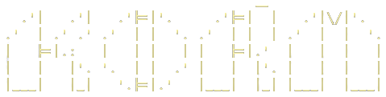
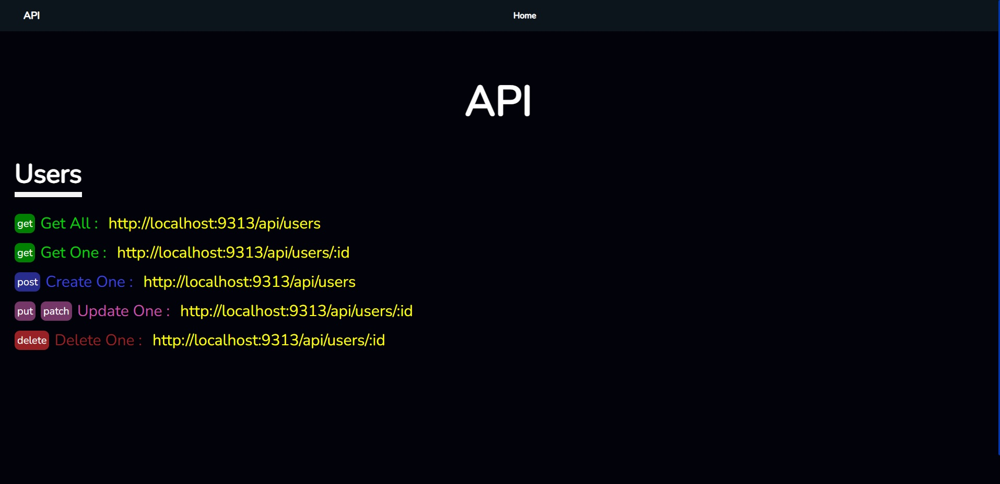

<div align="center">
	
</div>
<br>
<div align="center">
	
	
	
	
	
	
</div>
<br>


<div align="center">
	<a href="https://kamalshkeir.dev" target="_blank">
		
	</a>
	<a href="https://www.linkedin.com/in/kamal-shkeir/">
		
	</a>
	<a href="https://www.buymeacoffee.com/kamalshkeir" target="_blank"></a>

	
</div>

---
### Introducing KORM - the elegant, lightning-fast ORM for all your concurrent and async needs. Inspired by the highly popular Django Framework, KORM offers similar functionality with the added bonus of performance
### Why settle for less when you can have the best ?
- Django become very hard to work with when you need concurrency and async, you will need django channels and a server like daphne or uvicorn, Go have the perfect implementation for me.
- Django can handle at most 300 request per second, Go handle 40,000 request per second (benchmarks done on my machine)
- The API is also more user-friendly and less verbose than Django's
- Deploying an executable binary file using Korm , with automatic TLS Let's encrypt, a built-in Admin Dashboard, Interactive Shell, Eventbus to communicate between multiple Korm applications is pretty neat
- Additionally, its caching system uses goroutines and channels to efficiently to clean the cache when rows or tables are created, updated, deleted, or dropped.
#### It is also composable, allowing for integration with a server bus using [WithBus](#example-with-bus-between-2-korm) when you want to scale or just synchronise your data between multiple Korm or [WithDashboard](#example-with-dashboard-you-dont-need-kormwithbus-with-it-because-withdashboard-already-call-it-and-return-the-server-bus-for-you) to have a complete setup of server bus and Admin Dashboard.
#####  All drivers are written in Go, eliminating the need for GCC or C compilers
##### Korm also supports both SQL databases and mongo through [Kormongo](https://github.com/kamalshkeir/kormongo), and has a consistent API for both


### It Has :
- <strong>New :</strong> [Crud Api From Model](#example-korm-api) , similar to Model Viewsets from django rest framework

- Simple [API](#api)

- [Admin dashboard](#example-with-dashboard-you-dont-need-kormwithbus-with-it-because-withdashboard-already-call-it-and-return-the-server-bus-for-you) with ready offline and installable PWA (using /static/sw.js and /static/manifest.webmanifest). All statics mentionned in `sw.js` will be cached and served by the service worker, you can inspect the Network Tab in the browser to check it

[Built-in Authentication](#auth-middleware-example) using `korm.Auth` , `korm.Admin` or `korm.BasicAuth` middlewares, whenever Auth and Admin middlewares are used, you get access to the `.User` model and variable `.IsAuthenticated` from any template html like this example [admin_nav.html](#example-admin-and-auth-user-model-and-isauthenticated) 

- [Interactive Shell](#interactive-shell), to CRUD in your databases `go run main.go shell` or `go run main.go mongoshell` for mongo

- Network Bus allowing you to send and recv data in realtime using pubsub websockets between your ORMs, so you can decide how you data will be distributed between different databases, see [Example](#example-with-bus-between-2-korm) 

- Compatible with official database/sql, and the Mongo official driver, so you can do your queries yourself using sql.DB or mongo.Client  `korm.GetConnection(dbName)` or `kormongo.GetConnection(dbName)`, and overall a painless integration of your existing codebases using database/sql

- [AutoMigrate](#automigrate) directly from struct, for mongo it will only link the struct to the tableName, allowing usage of BuilderS. For all sql, whenever you add or remove a field from a migrated struct, you will get a prompt proposing to add the column for the table in the database or remove a column, you can also only generate the query without execute, and then you can use the shell to migrate the generated file, to disable the check for sql, you can use `korm.DisableCheck()`

- [Router/Mux](https://github.com/kamalshkeir/kmux) accessible from the serverBus after calling `korm.WithBus()` or `korm.WithDashboard()`

- [Hooks](#hooks) : OnInsert OnSet OnDelete and OnDrop

- [many to many](#manytomany-relationships-example) relationships

- [GENERATED ALWAYS AS](#example-generated-tag) tag added (all dialects)

- [Concatination and Length](#example-concat-and-len-from-korm_testgo) support for `Where` and for tags: `check` and `generated` (all dialects)

- Support for foreign keys, indexes , checks,... [See all](#automigrate)

- [PPROF](#pprof) Go std library profiling tool

- [Kenv](#example-not-required-load-config-from-env-directly-to-struct-using-kenv) load env vars to struct

- [Python Bus Client](#python-bus-client-example) `pip install ksbus`

#### Supported databases:
- Sqlite
- Postgres
- Mysql
- Maria
- Cockroach
- Mongo via [MONGO](https://github.com/kamalshkeir/kormongo)


---
# Installation

```sh
go get -u github.com/kamalshkeir/korm@v1.4.8 // latest version
```

# Drivers moved outside this package to not get them all in your go.mod file
```sh
go get -u github.com/kamalshkeir/sqlitedriver@v1.2.1
go get -u github.com/kamalshkeir/pgdriver@v1.0.0
go get -u github.com/kamalshkeir/mysqldriver@v1.0.0
```

```sh
go get -u github.com/kamalshkeir/kormongo@latest // Mongo ORM
```

### Global Vars
```go
// Debug when true show extra useful logs for queries executed for migrations and queries statements
Debug = false
// FlushCacheEvery execute korm.FlushCache() every 10 min by default, you should not worry about it, but useful that you can change it
FlushCacheEvery = 10 * time.Minute
// SetCacheMaxMemory set max size of each cache cacheAllS AllM ...
korm.SetCacheMaxMemory(megaByte int) // default maximum of 50 Mb , cannot be lower
// Connection pool
MaxOpenConns = 20
MaxIdleConns = 20
MaxLifetime = 30 * time.Minute
MaxIdleTime = 15 * time.Minute
```

### Connect to a database
```go
// mongodb
err := kormongo.New("dbmongo", "localhost:27017")
// sqlite
sqlitedriver.Use() // load sqlite driver --> go get github.com/kamalshkeir/sqlitedriver
err := korm.New(korm.SQLITE, "db") // Connect
// postgres, cockroach
pgdriver.Use() // load postgres driver  --> go get github.com/kamalshkeir/pgdriver
err := korm.New(korm.POSTGRES,"dbName", "user:password@localhost:5432") // Connect
// mysql, maria
mysqldriver.Use() // load mysql driver  --> go get github.com/kamalshkeir/mysqldriver
err := korm.New(korm.MYSQL,"dbName","user:password@localhost:3306") // Connect

korm.Shutdown(databasesName ...string) error
kormongo.ShutdownDatabases(databasesName ...string) error
```

### Hello world example

```go
package main

import (
	"time"

	"github.com/kamalshkeir/argon"
	"github.com/kamalshkeir/klog"
	"github.com/kamalshkeir/korm"
	"github.com/kamalshkeir/sqlitedriver"
)

type Profile struct {
	Id        int       `korm:"pk"` // AUTO Increment ID primary key
	Name      string    // VARCHAR(40)
	Email     string    `korm:"size:50;iunique"` // VARCHAR(50) insensitive unique constraint
	Password  string    `korm:"size:150"`        // VARCHAR(150)
	IsAdmin   bool      `korm:"default:false"`   // NOT NULL CHECK is_admin IN (0,1) DEFAULT 0
	CreatedAt time.Time `korm:"now"`             // auto now
	UpdatedAt time.Time `korm:"update"`          // auto update
	Age       int
	AgeTwice  int `korm:"generated:age*2"`
	//Role string `korm:"default:'worker'"`
}

func main() {
	sqlitedriver.Use()
	err := korm.New(korm.SQLITE, "db")
	if klog.CheckError(err) {
		return
	}

	err = korm.AutoMigrate[Profile]("profiles")
	if klog.CheckError(err) {
		return
	}

	//srv := korm.WithDashboard()
	//app := srv.App

	defer func() {
		err := korm.Shutdown("db")
		klog.CheckError(err)
	}()

	password := "123456"
	hashedPass, _ := argon.Hash(password)

	// Insert return the inserted PK
	insertedId, err := korm.Model[Profile]().Insert(&Profile{
		Name:     "sarra",
		Email:    "test@example.com",
		Password: hashedPass,
		IsAdmin:  false,
		Age:      20,
		//CreatedAt: time.Now(), // not needed because it's auto new
	})
	if klog.CheckError(err) {
		return
	}
	klog.Printf("inserted profile id : %d \n", insertedId)

	// InsertR return the inserted model , here it's User
	insertedProfile, err := korm.Model[Profile]().InsertR(&Profile{
		Name:     "ali",
		Email:    "test1@example.com",
		Password: hashedPass,
		IsAdmin:  !true,
		Age:      20,
	})
	if klog.CheckError(err) {
		return
	}

	insertedProfile2, err := korm.Model[Profile]().InsertR(&Profile{
		Name:     "sarra",
		Email:    "test2@example.com",
		Password: hashedPass,
		IsAdmin:  true,
		Age:      40,
	})
	if klog.CheckError(err) {
		return
	}

	klog.Printf("inserted userd name returned : %s \n", insertedProfile.Name)  // should be "ali"
	klog.Printf("inserted userd name returned : %s \n", insertedProfile2.Name) // should be "sarra"

	// profiles, err := korm.Model[Profile]().Select("email", "uuid").OrderBy("-id").Limit(10).Page(1).All()
	profiles, err := korm.Model[Profile]().All()
	klog.CheckError(err)

	klog.Printf("all users: %v\n", profiles)
	//srv.Run(":9313")
}
```


### AutoMigrate 

[Available Tags](#available-tags-by-struct-field-type) (SQL)

SQL:
```go
korm.AutoMigrate[T comparable](tableName string, dbName ...string) error 

err := korm.AutoMigrate[User]("users")
err := korm.AutoMigrate[Bookmark ]("bookmarks")

type User struct {
	Id        int       `korm:"pk"` // AUTO Increment ID primary key
	Uuid      string    `korm:"size:40"` // VARCHAR(50)
	Email     string    `korm:"size:50;iunique"` // insensitive unique
	Password  string    `korm:"size:150"` // VARCHAR(150)
	IsAdmin   bool      `korm:"default:false"` // DEFAULT 0
	Image     string    `korm:"size:100;default:''"`
	CreatedAt time.Time `korm:"now"` // auto now
    Ignored   string    `korm:"-"`
}

type Bookmark struct {
	Id      uint   `korm:"pk"`
	UserId  int    `korm:"fk:users.id:cascade:setnull"` // options cascade,donothing/noaction, setnull/null, setdefault/default
	IsDone	bool   
	ToCheck string `korm:"size:50; notnull; check: len(to_check) > 2 AND len(to_check) < 10; check: is_done=true"`  // column type will be VARCHAR(50)
	Content string `korm:"text"` // column type will be TEXT not VARCHAR
	UpdatedAt time.Time `korm:"update"` // will update when model updated, handled by triggers for sqlite, cockroach and postgres, and on migration for mysql
	CreatedAt time.Time `korm:"now"` // now is default to current timestamp and of type TEXT for sqlite
}

all, _ := korm.Model[User]()
                   .Where("id = ?",id) // notice here not like mongo, mongo will be like Where("_id",id) without '= ?'
                   .Select("item1","item2")
                   .OrderBy("created")
				   .Limit(8)
				   .Page(2)
                   .All()
```

MONGO: (No TAGS), only primitive.ObjectID `bson:"_id"` is mandatory
```go
type FirstTable struct {
	Id      primitive.ObjectID `bson:"_id"`
	Num     uint
	Item1   string
	Item2   string
	Bool1   bool
	Created time.Time
}

err = korm.AutoMigrate[FirstTable]("first_table")
klog.CheckError(err)

id,_ := primitive.ObjectIDFromHex("636d4c7bcfde1f5b625f12a4")
all, _ := korm.Model[FirstTable]()
                   .Where("_id",id) // notice here for mongo it's not like sql Where("_id = ?",id) 
                   .Select("item1","item2")
                   .OrderBy("created")
				   .Limit(8)
				   .Page(2)
                   .All()
```

### API
#### General
```go
func New(dbType, dbName string, dbDSN ...string) error
func NewFromConnection(dbType, dbName string, conn *sql.DB) error
func NewFromConnection(dbName string,dbConn *mongo.Database) error (kormongo)
func QueryS[T any](dbName string, statement string, args ...any) ([]T, error)
func Query(dbName string, statement string, args ...any) ([]map[string]any, error)
func Exec(dbName, query string, args ...any) error
func Transaction(dbName ...string) (*sql.Tx, error)
func WithBus(bus *ksbus.Server) *ksbus.Server // Usage: WithBus(ksbus.NewServer()) or share an existing one
func WithDashboard(staticAndTemplatesEmbeded ...embed.FS) *ksbus.Server
func BeforeServersData(fn func(data any, conn *ws.Conn))
func BeforeDataWS(fn func(data map[string]any, conn *ws.Conn, originalRequest *http.Request) bool)
func GetConnection(dbName ...string) *sql.DB
func GetAllTables(dbName ...string) []string
func GetAllColumnsTypes(table string, dbName ...string) map[string]string
func GetMemoryTable(tbName string, dbName ...string) (TableEntity, error)
func GetMemoryTables(dbName ...string) ([]TableEntity, error)
func GetMemoryDatabases() []DatabaseEntity
func GetMemoryDatabase(dbName string) (*DatabaseEntity, error)
func Shutdown(databasesName ...string) error
func FlushCache()
func DisableCheck() // Korm Only, disable struct check on change to add or remove column
func ManyToMany(table1, table2 string, dbName ...string) error // add table relation m2m 
```
#### Builder `Struct`:
```go
korm.Exec(dbName, query string, args ...any) error
korm.Transaction(dbName ...string) (*sql.Tx, error)
// Model is a starter for Buider
func Model[T comparable](tableName ...string) *BuilderS[T]
// Database allow to choose database to execute query on
func (b *BuilderS[T]) Database(dbName string) *BuilderS[T]
// Insert insert a row into a table and return inserted PK
func (b *BuilderS[T]) Insert(model *T) (int, error)
// InsertR add row to a table using input struct, and return the inserted row
func (b *BuilderS[T]) InsertR(model *T) (T, error)
// BulkInsert insert many row at the same time in one query
func (b *BuilderS[T]) BulkInsert(models ...*T) ([]int, error)
// AddRelated used for many to many, and after korm.ManyToMany, to add a class to a student or a student to a class, class or student should exist in the database before adding them
func (b *BuilderS[T]) AddRelated(relatedTable string, whereRelatedTable string, whereRelatedArgs ...any) (int, error)
// DeleteRelated delete a relations many to many
func (b *BuilderS[T]) DeleteRelated(relatedTable string, whereRelatedTable string, whereRelatedArgs ...any) (int, error)
// GetRelated used for many to many to get related classes to a student or related students to a class
func (b *BuilderS[T]) GetRelated(relatedTable string, dest any) error
// JoinRelated same as get, but it join data
func (b *BuilderS[T]) JoinRelated(relatedTable string, dest any) error
// Set used to update, Set("email,is_admin","example@mail.com",true) or Set("email = ? AND is_admin = ?","example@mail.com",true)
func (b *BuilderS[T]) Set(query string, args ...any) (int, error)
// Delete data from database, can be multiple, depending on the where, return affected rows(Not every database or database driver may support affected rows)
func (b *BuilderS[T]) Delete() (int, error)
// Drop drop table from db
func (b *BuilderS[T]) Drop() (int, error)
// Select usage: Select("email","password")
func (b *BuilderS[T]) Select(columns ...string) *BuilderS[T]
// Where can be like : Where("id > ?",1) or Where("id",1) = Where("id = ?",1)
func (b *BuilderS[T]) Where(query string, args ...any) *BuilderS[T]
// Limit set limit
func (b *BuilderS[T]) Limit(limit int) *BuilderS[T]
// Context allow to query or execute using ctx
func (b *BuilderS[T]) Context(ctx context.Context) *BuilderS[T]
// Page return paginated elements using Limit for specific page
func (b *BuilderS[T]) Page(pageNumber int) *BuilderS[T]
// OrderBy can be used like: OrderBy("-id","-email") OrderBy("id","-email") OrderBy("+id","email")
func (b *BuilderS[T]) OrderBy(fields ...string) *BuilderS[T]
// Debug print prepared statement and values for this operation
func (b *BuilderS[T]) Debug() *BuilderS[T]
// All get all data
func (b *BuilderS[T]) All() ([]T, error)
// One get single row
func (b *BuilderS[T]) One() (T, error)

Examples:
korm.Model[models.User]().Select("email","uuid").OrderBy("-id").Limit(PAGINATION_PER).Page(1).All()

// INSERT
uuid,_ := korm.GenerateUUID()
hashedPass,_ := argon.Hash(password)
korm.Model[models.User]().Insert(&models.User{
	Uuid: uuid,
	Email: "test@example.com",
	Password: hashedPass,
	IsAdmin: false,
	Image: "",
	CreatedAt: time.Now(),
})

//if using more than one db
korm.Database[models.User]("dbNameHere").Where("id = ? AND email = ?",1,"test@example.com").All() 

// where
korm.Model[models.User]().Where("id = ? AND email = ?",1,"test@example.com").One() 

// delete
korm.Model[models.User]().Where("id = ? AND email = ?",1,"test@example.com").Delete()

// drop table
korm.Model[models.User]().Drop()

// update
korm.Model[models.User]().Where("id = ?",1).Set("email = ?","new@example.com")
```
#### Builder `map[string]any`:
```go
// BuilderM is query builder map string any
type BuilderM struct
// Table is a starter for BuiderM
func Table(tableName string) *BuilderM
// Database allow to choose database to execute query on
func (b *BuilderM) Database(dbName string) *BuilderM
// Select select table columns to return
func (b *BuilderM) Select(columns ...string) *BuilderM
// Where can be like: Where("id > ?",1) or Where("id",1) = Where("id = ?",1)
func (b *BuilderM) Where(query string, args ...any) *BuilderM
// Limit set limit
func (b *BuilderM) Limit(limit int) *BuilderM
// Page return paginated elements using Limit for specific page
func (b *BuilderM) Page(pageNumber int) *BuilderM
// OrderBy can be used like: OrderBy("-id","-email") OrderBy("id","-email") OrderBy("+id","email")
func (b *BuilderM) OrderBy(fields ...string) *BuilderM
// Context allow to query or execute using ctx
func (b *BuilderM) Context(ctx context.Context) *BuilderM
// Debug print prepared statement and values for this operation
func (b *BuilderM) Debug() *BuilderM
// All get all data
func (b *BuilderM) All() ([]map[string]any, error)
// One get single row
func (b *BuilderM) One() (map[string]any, error)
// Insert add row to a table using input map, and return PK of the inserted row
func (b *BuilderM) Insert(rowData map[string]any) (int, error)
// InsertR add row to a table using input map, and return the inserted row
func (b *BuilderM) InsertR(rowData map[string]any) (map[string]any, error)
// BulkInsert insert many row at the same time in one query
func (b *BuilderM) BulkInsert(rowsData ...map[string]any) ([]int, error)
// Set used to update, Set("email,is_admin","example@mail.com",true) or Set("email = ? AND is_admin = ?","example@mail.com",true)
func (b *BuilderM) Set(query string, args ...any) (int, error)
// Delete data from database, can be multiple, depending on the where, return affected rows(Not every database or database driver may support affected rows)
func (b *BuilderM) Delete() (int, error)
// Drop drop table from db
func (b *BuilderM) Drop() (int, error)
// AddRelated used for many to many, and after korm.ManyToMany, to add a class to a student or a student to a class, class or student should exist in the database before adding them
func (b *BuilderM) AddRelated(relatedTable string, whereRelatedTable string, whereRelatedArgs ...any) (int, error)
// GetRelated used for many to many to get related classes to a student or related students to a class
func (b *BuilderM) GetRelated(relatedTable string, dest *[]map[string]any) error
// JoinRelated same as get, but it join data
func (b *BuilderM) JoinRelated(relatedTable string, dest *[]map[string]any) error
// DeleteRelated delete a relations many to many
func (b *BuilderM) DeleteRelated(relatedTable string, whereRelatedTable string, whereRelatedArgs ...any) (int, error)


Examples:

sliceMapStringAny,err := korm.Table("users")
							.Select("email","uuid")
							.OrderBy("-id")
							.Limit(PAGINATION_PER)
							.Page(1)
							.All()

// INSERT
uuid,_ := korm.GenerateUUID()
hashedPass,_ := argon.Hash("password") // github.com/kamalshkeir/argon

korm.Table("users").Insert(map[string]any{
	"uuid":uuid,
	"email":"test@example.com",
	 ...
})

//if using more than one db
korm.Database("dbNameHere").Table("tableName").Where("id = ? AND email = ?",1,"test@example.com").All() 

// where
Where("id = ? AND email = ?",1,"test@example.com") // this work
Where("id,email",1,"test@example.com") // and this work

korm.Table("tableName").Where("id = ? AND email = ?",1,"test@example.com").One() // SQL
kormongo.Table("tableName").Where("id, email",1,"test@example.com").One() // Mongo

// delete
korm.Table("tableName").Where("id = ? AND email = ?",1,"test@example.com").Delete() // SQL
kormongo.Table("tableName").Where("id,email", 1, "test@example.com").Delete() // Mongo

// drop table
korm.Table("tableName").Drop()

// update
korm.Table("tableName").Where("id = ?",1).Set("email = ?","new@example.com") // SQL 
korm.Table("tableName").Where("id",1).Set("email","new@example.com") 

korm.Table("tableName").Where("id",1).Set("email","new@example.com") // Mongo
```

### Dashboard defaults you can set
```go
korm.Pprof              = false
korm.PaginationPer      = 10
korm.EmbededDashboard   = false
korm.MediaDir           = "media"
korm.AssetsDir          = "assets"
korm.StaticDir          = path.Join(AssetsDir, "/", "static")
korm.TemplatesDir       = path.Join(AssetsDir, "/", "templates")
korm.RepoUser           = "kamalshkeir"
korm.RepoName           = "korm-dashboard"
korm.AdminPathNameGroup = "/admin"
// so you can create a custom dashboard, upload it to your repos and change like like above korm.RepoUser and korm.RepoName
```

### Example With Dashboard (you don't need korm.WithBus with it, because WithDashboard already call it and return the server bus for you)

```go
package main

import (
	"github.com/kamalshkeir/klog"
	"github.com/kamalshkeir/kmux"
	"github.com/kamalshkeir/korm"
	"github.com/kamalshkeir/sqlitedriver"
)

func main() {
	sqlitedriver.Use()
	err := korm.New(korm.SQLITE, "db")
	klog.CheckError(err)


	serverBus := korm.WithDashboard() 
	// you can overwrite Admin and Auth middleware used for dashboard (dash_middlewares.go) 
	//korm.Auth = func(handler kmux.Handler) kmux.Handler {}
	//korm.Admin = func(handler kmux.Handler) kmux.Handler {}

	// and also all handlers (dash_views.go)
	//korm.LoginView = func(c *kmux.Context) {
	//	c.Html("admin/new_admin_login.html", nil)
	//}

	// add extra static directory if you want
	//serverBus.App.LocalStatics("assets/mystatic","myassets") // will be available at /myassets/*
	//serverBus.App.LocalTemplates("assets/templates") // will make them available to use with c.Html

	// serve HTML 
	// serverBus.App.Get("/",func(c *kmux.Context) {
	// 	c.Html("index.html", map[string]any{
	// 		"data": data,
	// 	})
	// })
	serverBus.Run("localhost:9313")
	// OR run https if you have certificates
	serverBus.RunTLS(addr string, cert string, certKey string)

	// OR generate certificates let's encrypt for a domain name, check https://github.com/kamalshkeir/ksbus for more infos
	serverBus.RunAutoTLS(domainName string, subDomains ...string)
}
```
Then create admin user to connect to the dashboard
```sh
go run main.go shell

createsuperuser
```

Then you can visit `/admin`


### Auth middleware example
```go
func main() {
	sqlitedriver.Use()
	err := korm.New(korm.SQLITE, "db")
	if klog.CheckError(err) {
		return
	}
	defer korm.Shutdown()

	srv := korm.WithDashboard()
	klog.Printfs("mgrunning on http://localhost:9313\n")
	app := srv.App

	app.GET("/", korm.Auth(func(c *kmux.Context) { // work with korm.Admin also
		// c.IsAuthenticated also return bool
		if v, ok := c.User(); ok {
			c.Json(map[string]any{
				"msg": "Authenticated",
				"v":   v.(korm.User).Email,
			})
		} else {
			c.Json(map[string]any{
				"error": "not auth",
			})
		}
	}))

	srv.Run("localhost:9313")
}
```

### Example Admin Auth User and IsAuthenticated
```html
{{define "admin_nav"}}
<header id="admin-header">
  <nav>
    <a href="/">
      <h1>KORM</h1>
    </a> 
    
    <ul>
        <li>
          <a {{if eq .Request.URL.Path "/" }}class="active"{{end}} href="/">Home</a>
        </li>

        <li>
          <a {{if contains .Request.URL.Path "/admin" }}class="active"{{end}} href="/admin">Admin</a>
        </li>

        {{if .IsAuthenticated}}
            <li>
              <a href="/admin/logout">Logout</a>
            </li>
            
            {{if .User.Email}}
              <li>
                <span>Hello {{.User.Email}}</span>
              </li>
            {{end}}
        {{end}}
    </ul>
  </nav>
</header>
{{end}}


```

### Admin middlewares

```go
// dash_middlewares.go
package korm

import (
	"context"
	"net/http"

	"github.com/kamalshkeir/aes"
	"github.com/kamalshkeir/kmux"
)


var Auth = func(handler kmux.Handler) kmux.Handler {
	const key kmux.ContextKey = "user"
	return func(c *kmux.Context) {
		session, err := c.GetCookie("session")
		if err != nil || session == "" {
			// NOT AUTHENTICATED
			c.DeleteCookie("session")
			handler(c)
			return
		}
		session, err = aes.Decrypt(session)
		if err != nil {
			handler(c)
			return
		}
		// Check session
		user, err := Model[User]().Where("uuid = ?", session).One()
		if err != nil {
			// session fail
			handler(c)
			return
		}

		// AUTHENTICATED AND FOUND IN DB
		ctx := context.WithValue(c.Request.Context(), key, user)
		*c = kmux.Context{
			Params:         c.ParamsMap(),
			Request:        c.Request.WithContext(ctx),
			ResponseWriter: c.ResponseWriter,
		}
		handler(c)
	}
}

var Admin = func(handler kmux.Handler) kmux.Handler {
	const key kmux.ContextKey = "user"
	return func(c *kmux.Context) {
		session, err := c.GetCookie("session")
		if err != nil || session == "" {
			// NOT AUTHENTICATED
			c.DeleteCookie("session")
			c.Status(http.StatusTemporaryRedirect).Redirect("/admin/login")
			return
		}
		session, err = aes.Decrypt(session)
		if err != nil {
			c.Status(http.StatusTemporaryRedirect).Redirect("/admin/login")
			return
		}
		user, err := Model[User]().Where("uuid = ?", session).One()

		if err != nil {
			// AUTHENTICATED BUT NOT FOUND IN DB
			c.Status(http.StatusTemporaryRedirect).Redirect("/admin/login")
			return
		}

		// Not admin
		if !user.IsAdmin {
			c.Status(403).Text("Middleware : Not allowed to access this page")
			return
		}

		ctx := context.WithValue(c.Request.Context(), key, user)
		*c = kmux.Context{
			Params:         c.ParamsMap(),
			Request:        c.Request.WithContext(ctx),
			ResponseWriter: c.ResponseWriter,
		}

		handler(c)
	}
}


var BasicAuth = func(handler kmux.Handler) kmux.Handler {
	return kmux.BasicAuth(handler, BASIC_AUTH_USER, BASIC_AUTH_PASS)
}
```

### Example korm api
```go
package main

import (
	"github.com/kamalshkeir/klog"
	"github.com/kamalshkeir/kmux"
	"github.com/kamalshkeir/korm"
	"github.com/kamalshkeir/sqlitedriver"
)

func main() {
	sqlitedriver.Use()
	err := korm.New(korm.SQLITE, "db")
	if klog.CheckError(err) {
		return
	}
	defer korm.Shutdown()

	bus := korm.WithDashboard()
	app := bus.App
	klog.Printfs("mgrunning on http://localhost:9313\n")
	app.GET("/", func(c *kmux.Context) {
		c.Text("hello")
	})

	korm.BASIC_AUTH_USER = "user"
	korm.BASIC_AUTH_PASS = "pass"
	err = korm.WithAPI("/api", korm.BasicAuth)
	if klog.CheckError(err) {
		return
	}
	// Register a table to the api

	// err = korm.RegisterTable(korm.TableRegistration[korm.User]{} // use defaults , all methods, Auth middleware, and no filters for query 
	// or , customize it : 
	err = korm.RegisterTable(korm.TableRegistration[korm.User]{
		//Methods: []string{"*"}, // default
		Methods: []string{"get","post"}, 

		//Middws: []func(handler kmux.Handler) kmux.Handler{korm.Auth}, // default
		Middws: []func(handler kmux.Handler) kmux.Handler{korm.Admin}, // users only accessible by admin

		BuilderGetAll: func(modelBuilder *korm.BuilderS[korm.User]) *korm.BuilderS[korm.User] { // for /users
			modelBuilder.Select("id")
			return modelBuilder
		},
		BuilderGetOne: func(modelBuilder *korm.BuilderS[korm.User]) *korm.BuilderS[korm.User] { // for /users/:pk
			modelBuilder.Select("uuid","email")
			return modelBuilder
		},
	})
	if klog.CheckError(err) {
		return
	}

	bus.Run(":9313")
}
```




### Example With Bus between 2 KORM
KORM 1:

```go
package main

import (
	"net/http"

	"github.com/kamalshkeir/klog"
	"github.com/kamalshkeir/kmux"
	"github.com/kamalshkeir/kmux/ws"
	"github.com/kamalshkeir/korm"
	"github.com/kamalshkeir/ksbus"
)

func main() {
	err := korm.New(korm.SQLITE,"db1")
	if klog.CheckError(err) {return}

	
	serverBus := korm.WithBus(ksbus.NewServer())
	// handler authentication	
	korm.BeforeDataWS(func(data map[string]any, conn *ws.Conn, originalRequest *http.Request) bool {
        klog.Printf("handle authentication here\n")
		return true
	})
	// handler data from other KORM
	korm.BeforeServersData(func(data any, conn *ws.Conn) {
		klog.Printf("grrecv orm2: %v\n",data) // 'gr' for green
	})

	// built in router to the bus, check it at https://github.com/kamalshkeir/ksbus
	serverBus.App.GET("/",func(c *kmux.Context) {
		serverBus.SendToServer("localhost:9314",map[string]any{
			"msg":"hello from server 1",
		})
		c.Text("ok")
	})

	
	serverBus.Run("localhost:9313")
	// OR run https if you have certificates
	serverBus.RunTLS(addr string, cert string, certKey string)
	// OR generate certificates let's encrypt for a domain name, check https://github.com/kamalshkeir/ksbus for more details
	serverBus.RunAutoTLS(domainName string, subDomains ...string)
}
```
KORM 2:
```go
package main

import (
	"net/http"

	"github.com/kamalshkeir/klog"
	"github.com/kamalshkeir/kmux"
	"github.com/kamalshkeir/kmux/ws"
	"github.com/kamalshkeir/korm"
)

func main() {
	err := korm.New(korm.SQLITE,"db2")
	if klog.CheckError(err) {return}

	
	serverBus := korm.WithBus(ksbus.NewServer())

	korm.BeforeServersData(func(data any, conn *ws.Conn) {
        klog.Printf("grrecv orm2: %v\n",data)
	})

	// built in router to the bus, check it at https://github.com/kamalshkeir/ksbus
	serverBus.App.GET("/",func(c *kmux.Context) {
		serverBus.SendToServer("localhost:9314",map[string]any{
			"msg":"hello from server 2",
		})
		c.Status(200).Text("ok")
	})


    // Run Server Bus
	serverBus.Run("localhost:9314")

	// OR run https if you have certificates
	serverBus.RunTLS(addr string, cert string, certKey string)

	// OR generate certificates let's encrypt for a domain name, check https://github.com/kamalshkeir/ksbus for more infos
	serverBus.RunAutoTLS(domainName string, subDomains ...string)
}
```

### Example generated tag
```go
// generated example using concatination and length
type TestUser struct {
	Id        *uint   `korm:"pk"`
	Uuid      string  `korm:"size:40;iunique"`
	Email     *string `korm:"size:100;iunique"`
	Gen       string  `korm:"size:250;generated: concat(uuid,'working',len(password))"`
	Password  string
	IsAdmin   *bool
	CreatedAt time.Time `korm:"now"`
	UpdatedAt time.Time `korm:"update"`
}

func TestGeneratedAs(t *testing.T) {
	u, err := Model[TestUser]().Limit(3).All()
	if err != nil {
		t.Error(err)
	}
	if len(u) != 3 {
		t.Error("len not 20")
	}
	if u[0].Gen != u[0].Uuid+"working"+fmt.Sprintf("%d", len(u[0].Password)) {
		t.Error("generated not working:", u[0].Gen)
	}
}
```


### Example concat and len from korm_test.go
```go
// Where example
func TestConcatANDLen(t *testing.T) {
	groupes, err := Model[Group]().Where("name = concat(?,'min') AND len(name) = ?", "ad", 5).Debug().All()
	// translated to select * from groups WHERE name = 'ad' || 'min'  AND  length(name) = 5 (sqlite)
	// translated to select * from groups WHERE name = concat('ad','min')  AND  char_length(name) = 5 (postgres, mysql)
	if err != nil {
		t.Error(err)
	}
	if len(groupes) != 1 || groupes[0].Name != "admin" {
		t.Error("len(groupes) != 1 , got: ", groupes)
	}
}
```


## Router/Mux 
Learn more about [Kmux](https://github.com/kamalshkeir/kmux)
```go

func main() {
	sqlitedriver.Use()
	err := korm.New(korm.SQLITE, "db")
	if err != nil {
		log.Fatal(err)
	}

	serverBus := korm.WithDashboard()

	mux := serverBus.App
	// add global middlewares
	mux.Use((midws ...func(http.Handler) http.Handler))
	mux.Use(kmux.Gzip(),kmux.Recover())
	...
}

```

### Pprof
```go

korm.Pprof=true (before WithDashboard)

will enable:
	- /debug/pprof
	- /debug/pprof/profile
	- /debug/pprof/heap
	- /debug/pprof/trace
```

# Hooks
```go
korm.OnInsert(func(database, table string, data map[string]any) error {
	fmt.Println("inserting into", database, table, data)
	// if error returned, it will not insert
	return nil
})

korm.OnSet(func(database, table string, data map[string]any) error {
	fmt.Println("set into", database, table, data)
	return nil
})

korm.OnDelete(func(database, table, query string, args ...any) error {})

korm.OnDrop(func(database, table string) error {})
```


## Python bus client example
```sh
pip install ksbus==1.1.0
# if it doesn't work , execute it again 
```
```py
from ksbus import Bus


# onOpen callback that let you know when connection is ready, it take the bus as param
def onOpen(bus):
    print("connected")
    # bus.autorestart=True
    # Publish publish to topic
    bus.Publish("top", {
        "data": "hello from python"
    })
    # Subscribe, it also return the subscription
    bus.Subscribe("python", pythonTopicHandler)
    # SendTo publish to named topic
    bus.SendTo("top:srv", {
        "data": "hello again from python"
    })
    # bus.Unsubscribe("python")
    print("finish everything")


# pythonTopicHandler handle topic 'python'
def pythonTopicHandler(data, subs):
    print("recv on topic python:", data)
    # Unsubscribe
    #subs.Unsubscribe()

if __name__ == "__main__":
    Bus("localhost:9313", onOpen=onOpen) # blocking
    print("prorgram exited")
```

# ManyToMany Relationships Example

```go
type Class struct {
	Id          uint   `korm:"pk"`
	Name        string `korm:"size:100"`
	IsAvailable bool
	CreatedAt   time.Time `korm:"now"`
}

type Student struct {
	Id        uint      `korm:"pk"`
	Name      string    `korm:"size:100"`
	CreatedAt time.Time `korm:"now"`
}

// migrate
func migrate() {
	err := korm.AutoMigrate[Class]("classes")
	if klog.CheckError(err) {
		return
	}
	err = korm.AutoMigrate[Student]("students")
	if klog.CheckError(err) {
		return
	}
	err = korm.ManyToMany("classes", "students")
	if klog.CheckError(err) {
		return
	}
}

// korm.ManyToMany create relation table named m2m_classes_students

// then you can use it like so to get related data

// get related to map to struct
std := []Student{}
err = korm.Model[Class]().Where("name = ?", "Math").Select("name").OrderBy("-name").Limit(1).GetRelated("students", &std)

// get related to map
std := []map[string]any{}
err = korm.Table("classes").Where("name = ?", "Math").Select("name").OrderBy("-name").Limit(1).GetRelated("students", &std)

// join related to map
std := []map[string]any{}
err = korm.Table("classes").Where("name = ?", "Math").JoinRelated("students", &std)

// join related to strcu
cu := []JoinClassUser{}
err = korm.Model[Class]().Where("name = ?", "Math").JoinRelated("students", &cu)

// to add relation
_, err = korm.Model[Class]().AddRelated("students", "name = ?", "hisName")
_, err = korm.Model[Student]().AddRelated("classes", "name = ?", "French")
_, err = korm.Table("students").AddRelated("classes", "name = ?", "French")

// delete relation
_, err = korm.Model[Class]().Where("name = ?", "Math").DeleteRelated("students", "name = ?", "hisName")
_, err = korm.Table("classes").Where("name = ?", "Math").DeleteRelated("students", "name = ?", "hisName")

```


### Interactive shell
```shell
AVAILABLE COMMANDS:
[databases, use, tables, columns, migrate, createsuperuser, createuser, getall, get, drop, delete, clear/cls, q/quit/exit, help/commands]
  'databases':
	  list all connected databases

  'use':
	  use a specific database

  'tables':
	  list all tables in database

  'columns':
	  list all columns of a table

  'migrate':
	  migrate or execute sql file

  'createsuperuser': #only with korm.WithDashboard()
	  create a admin user
  
  'createuser':  #only with korm.WithDashboard()
	  create a regular user

  'getall':
	  get all rows given a table name

  'get':
	  get single row wher field equal_to

  'delete':
	  delete rows where field equal_to

  'drop':
	  drop a table given table name

  'clear/cls':
	  clear console
```


# Example, not required, Load config from env directly to struct using Kenv
```go
import "github.com/kamalshkeir/kenv"

type EmbedS struct {
	Static    bool `kenv:"EMBED_STATIC|false"`
	Templates bool `kenv:"EMBED_TEMPLATES|false"`
}

type GlobalConfig struct {
	Host       string `kenv:"HOST|localhost"` // DEFAULT to 'localhost': if HOST not found in env
	Port       string `kenv:"PORT|9313"`
	Embed 	   EmbedS
	Db struct {
		Name     string `kenv:"DB_NAME|db"` // NOT REQUIRED: if DB_NAME not found, defaulted to 'db'
		Type     string `kenv:"DB_TYPE"` // REEQUIRED: this env var is required, you will have error if empty
		DSN      string `kenv:"DB_DSN|"` // NOT REQUIRED: if DB_DSN not found it's not required, it's ok to stay empty
	}
	Smtp struct {
		Email string `kenv:"SMTP_EMAIL|"`
		Pass  string `kenv:"SMTP_PASS|"`
		Host  string `kenv:"SMTP_HOST|"`
		Port  string `kenv:"SMTP_PORT|"`
	}
	Profiler   bool   `kenv:"PROFILER|false"`
	Docs       bool   `kenv:"DOCS|false"`
	Logs       bool   `kenv:"LOGS|false"`
	Monitoring bool   `kenv:"MONITORING|false"`
}


kenv.Load(".env") // load env file

// Fill struct from env loaded before:
Config := &GlobalConfig{}
err := kenv.Fill(Config) // fill struct with env vars loaded before
```


# Benchmarks
```sh
goos: windows
goarch: amd64
pkg: github.com/kamalshkeir/korm/benchmarks
cpu: Intel(R) Core(TM) i5-7300HQ CPU @ 2.50GHz
```

To execute these benchmarks on your machine, very easy :

- git clone https://github.com/kamalshkeir/korm.git
- cd korm
- uncomment commented code at benchmarks/bench-test.go and Save
- go mod tidy
- go test -bench ^ .\benchmarks\ -benchmem

```go
type TestTable struct {
	Id        uint `korm:"pk"`
	Email     string
	Content   string
	Password  string
	IsAdmin   bool
	CreatedAt time.Time `korm:"now"`
	UpdatedAt time.Time `korm:"update"`
}

type TestTableGorm struct {
	Id        uint `gorm:"primarykey"`
	Email     string
	Content   string
	Password  string
	IsAdmin   bool
	CreatedAt time.Time
	UpdatedAt time.Time
}
////////////////////////////////////////////  query 7000 rows  //////////////////////////////////////////////
BenchmarkGetAllS_GORM-4                       19          56049832 ns/op        12163316 B/op     328790 allocs/op
BenchmarkGetAllS-4                       2708934               395.3 ns/op           224 B/op          1 allocs/op
BenchmarkGetAllM_GORM-4                       18          62989567 ns/op        13212278 B/op     468632 allocs/op
BenchmarkGetAllM-4                       4219461               273.5 ns/op           224 B/op          1 allocs/op
BenchmarkGetRowS_GORM-4                    12188             96988 ns/op            5930 B/op        142 allocs/op
BenchmarkGetRowS-4                       1473164               805.1 ns/op           336 B/op          7 allocs/op
BenchmarkGetRowM_GORM-4                    11402            101638 ns/op            7408 B/op        203 allocs/op
BenchmarkGetRowM-4                       1752652               671.9 ns/op           336 B/op          7 allocs/op
BenchmarkPagination10_GORM-4                7714            153304 ns/op           19357 B/op        549 allocs/op
BenchmarkPagination10-4                  1285722               934.5 ns/op           400 B/op          7 allocs/op
BenchmarkPagination100_GORM-4               1364            738934 ns/op          165423 B/op       4704 allocs/op
BenchmarkPagination100-4                 1278724               956.5 ns/op           400 B/op          7 allocs/op
BenchmarkQueryS-4                        5781499               207.7 ns/op             4 B/op          1 allocs/op
BenchmarkQueryM-4                        4643155               227.2 ns/op             4 B/op          1 allocs/op
BenchmarkGetAllTables-4                 47465865                25.48 ns/op            0 B/op          0 allocs/op
BenchmarkGetAllColumns-4                23657019                42.82 ns/op            0 B/op          0 allocs/op
////////////////////////////////////////////  query 5000 rows  //////////////////////////////////////////////
BenchmarkGetAllS_GORM-4                       24          43247546 ns/op         8796840 B/op     234784 allocs/op
BenchmarkGetAllS-4                       2854401               426.8 ns/op           224 B/op          1 allocs/op
BenchmarkGetAllM_GORM-4                       24          46329242 ns/op         9433050 B/op     334631 allocs/op
BenchmarkGetAllM-4                       4076317               283.4 ns/op           224 B/op          1 allocs/op
BenchmarkGetRowS_GORM-4                    11445            101107 ns/op            5962 B/op        142 allocs/op
BenchmarkGetRowS-4                       1344831               848.4 ns/op           336 B/op          7 allocs/op
BenchmarkGetRowM_GORM-4                    10000            100969 ns/op            7440 B/op        203 allocs/op
BenchmarkGetRowM-4                       1721742               688.5 ns/op           336 B/op          7 allocs/op
BenchmarkPagination10_GORM-4                7500            156208 ns/op           19423 B/op        549 allocs/op
BenchmarkPagination10-4                  1253757               952.3 ns/op           400 B/op          7 allocs/op
BenchmarkPagination100_GORM-4               1564            749408 ns/op          165766 B/op       4704 allocs/op
BenchmarkPagination100-4                 1236270               957.5 ns/op           400 B/op          7 allocs/op
BenchmarkGetAllTables-4                 44399386                25.43 ns/op            0 B/op          0 allocs/op
BenchmarkGetAllColumns-4                27906392                41.45 ns/op            0 B/op          0 allocs/op
////////////////////////////////////////////  query 1000 rows  //////////////////////////////////////////////
BenchmarkGetAllS_GORM-4                      163           6766871 ns/op         1683919 B/op      46735 allocs/op
BenchmarkGetAllS-4                       2882660               399.0 ns/op           224 B/op          1 allocs/op
BenchmarkGetAllM_GORM-4                      140           8344988 ns/op         1886922 B/op      66626 allocs/op
BenchmarkGetAllM-4                       3826730               296.5 ns/op           224 B/op          1 allocs/op
BenchmarkGetRowS_GORM-4                    11940             97725 ns/op            5935 B/op        142 allocs/op
BenchmarkGetRowS-4                       1333258               903.0 ns/op           336 B/op          7 allocs/op
BenchmarkGetRowM_GORM-4                    10000            106079 ns/op            7408 B/op        203 allocs/op
BenchmarkGetRowM-4                       1601274               748.2 ns/op           336 B/op          7 allocs/op
BenchmarkPagination10_GORM-4                7534            159991 ns/op           19409 B/op        549 allocs/op
BenchmarkPagination10-4                  1153982              1022 ns/op             400 B/op          7 allocs/op
BenchmarkPagination100_GORM-4               1468            766269 ns/op          165876 B/op       4705 allocs/op
BenchmarkPagination100-4                 1000000              1016 ns/op             400 B/op          7 allocs/op
BenchmarkGetAllTables-4                 56200297                25.36 ns/op            0 B/op          0 allocs/op
BenchmarkGetAllColumns-4                25478679                41.30 ns/op            0 B/op          0 allocs/op
////////////////////////////////////////////  query 300 rows  //////////////////////////////////////////////
BenchmarkGetAllS_GORM-4                      558           2046830 ns/op          458475 B/op      13823 allocs/op
BenchmarkGetAllS-4                       2798872               411.5 ns/op           224 B/op          1 allocs/op
BenchmarkGetAllM_GORM-4                      428           2605646 ns/op          567011 B/op      19721 allocs/op
BenchmarkGetAllM-4                       4093662               287.9 ns/op           224 B/op          1 allocs/op
BenchmarkGetRowS_GORM-4                    12182             97764 ns/op            5966 B/op        142 allocs/op
BenchmarkGetRowS-4                       1347084               886.4 ns/op           336 B/op          7 allocs/op
BenchmarkGetRowM_GORM-4                    10000            105311 ns/op            7440 B/op        203 allocs/op
BenchmarkGetRowM-4                       1390363               780.0 ns/op           336 B/op          7 allocs/op
BenchmarkPagination10_GORM-4                7502            155949 ns/op           19437 B/op        549 allocs/op
BenchmarkPagination10-4                  1000000              1046 ns/op             400 B/op          7 allocs/op
BenchmarkPagination100_GORM-4               1479            779700 ns/op          165679 B/op       4705 allocs/op
BenchmarkPagination100-4                 1000000              1054 ns/op             400 B/op          7 allocs/op
BenchmarkGetAllTables-4                 52255704                26.00 ns/op            0 B/op          0 allocs/op
BenchmarkGetAllColumns-4                29292368                42.09 ns/op            0 B/op          0 allocs/op
////////////////////////////////////////////    MONGO       //////////////////////////////////////////////
BenchmarkGetAllS-4               3121384               385.6 ns/op           224 B/op          1 allocs/op
BenchmarkGetAllM-4               4570059               264.2 ns/op           224 B/op          1 allocs/op
BenchmarkGetRowS-4               1404399               866.6 ns/op           336 B/op          7 allocs/op
BenchmarkGetRowM-4               1691026               722.6 ns/op           336 B/op          7 allocs/op
BenchmarkGetAllTables-4         47424489                25.34 ns/op            0 B/op          0 allocs/op
BenchmarkGetAllColumns-4        27039632                42.22 ns/op            0 B/op          0 allocs/op
//////////////////////////////////////////////////////////////////////////////////////////////////////////
```


---
### Available Tags by struct field type:

# String Field:
<table>
<tr>
<th>Without parameter&nbsp;&nbsp;&nbsp;&nbsp;&nbsp;&nbsp;&nbsp;&nbsp;&nbsp;&nbsp;&nbsp;&nbsp;&nbsp;&nbsp;&nbsp;&nbsp;</th>
<th>With parameter&nbsp;&nbsp;&nbsp;&nbsp;&nbsp;&nbsp;&nbsp;&nbsp;&nbsp;&nbsp;&nbsp;&nbsp;&nbsp;&nbsp;&nbsp;&nbsp;&nbsp;&nbsp;&nbsp;&nbsp;&nbsp;&nbsp;&nbsp;&nbsp;&nbsp;&nbsp;&nbsp;</th>
</tr>
<tr>
<td>
 
```
*  	text (create column as TEXT not VARCHAR)
*  	notnull
*  	unique
*   iunique // insensitive unique
*  	index, +index, index+ (INDEX ascending)
*  	index-, -index (INDEX descending)
*  	default (DEFAULT '')
```
</td>
<td>

```
* 	default:'any' (DEFAULT 'any')
*	mindex:...
* 	uindex:username,Iemail // CREATE UNIQUE INDEX ON users (username,LOWER(email)) 
	// 	email is lower because of 'I' meaning Insensitive for email
* 	fk:...
* 	size:50  (VARCHAR(50))
* 	check:...
```

</td>
</tr>
</table>


---


# Int, Uint, Int64, Uint64 Fields:
<table>
<tr>
<th>Without parameter&nbsp;&nbsp;&nbsp;&nbsp;&nbsp;&nbsp;&nbsp;&nbsp;&nbsp;&nbsp;&nbsp;&nbsp;&nbsp;&nbsp;&nbsp;&nbsp;</th>
</tr>
<tr>
<td>
 
```
*   -  			 (To Ignore a field)
*   autoinc, pk  (PRIMARY KEY)
*   notnull      (NOT NULL)
*  	index, +index, index+ (CREATE INDEX ON COLUMN)
*  	index-, -index(CREATE INDEX DESC ON COLUMN)     
*   unique 		 (CREATE UNIQUE INDEX ON COLUMN) 
*   default		 (DEFAULT 0)
```
</td>
</tr>

<tr><th>With parameter&nbsp;&nbsp;&nbsp;&nbsp;&nbsp;&nbsp;&nbsp;&nbsp;&nbsp;&nbsp;&nbsp;&nbsp;&nbsp;&nbsp;&nbsp;&nbsp;&nbsp;&nbsp;&nbsp;&nbsp;&nbsp;&nbsp;&nbsp;&nbsp;&nbsp;&nbsp;&nbsp;</th></tr>
<tr>
<td>

```
Available 'on_delete' and 'on_update' options: cascade,(donothing,noaction),(setnull,null),(setdefault,default)

*   fk:{table}.{column}:{on_delete}:{on_update} 
*   check: len(to_check) > 10 ; check: is_used=true (You can chain checks or keep it in the same CHECK separated by AND)
*   mindex: first_name, last_name (CREATE MULTI INDEX ON COLUMN + first_name + last_name)
*   uindex: first_name, last_name (CREATE MULTI UNIQUE INDEX ON COLUMN + first_name + last_name) 
*   default:5 (DEFAULT 5)
```

</td>
</tr>
</table>

---


# Bool : bool is INTEGER NOT NULL checked between 0 and 1 (in order to be consistent accross sql dialects)
<table>
<tr>
<th>Without parameter&nbsp;&nbsp;&nbsp;&nbsp;&nbsp;&nbsp;&nbsp;&nbsp;&nbsp;&nbsp;&nbsp;&nbsp;&nbsp;&nbsp;&nbsp;&nbsp;</th>
<th>With parameter&nbsp;&nbsp;&nbsp;&nbsp;&nbsp;&nbsp;&nbsp;&nbsp;&nbsp;&nbsp;&nbsp;&nbsp;&nbsp;&nbsp;&nbsp;&nbsp;&nbsp;&nbsp;&nbsp;&nbsp;&nbsp;&nbsp;&nbsp;&nbsp;&nbsp;&nbsp;&nbsp;</th>
</tr>
<tr>
<td>
 
```
*  	index, +index, index+ (CREATE INDEX ON COLUMN)
*  	index-, -index(CREATE INDEX DESC ON COLUMN)  
*   default (DEFAULT 0)
```
</td>
<td>

```
*   default:1 (DEFAULT 1)
*   mindex:...
*   fk:...
```

</td>
</tr>
</table>

---

# time.Time :
<table>
<tr>
<th>Without parameter&nbsp;&nbsp;&nbsp;&nbsp;&nbsp;&nbsp;&nbsp;&nbsp;&nbsp;&nbsp;&nbsp;&nbsp;&nbsp;&nbsp;&nbsp;&nbsp;</th>
<th>With parameter</th>
</tr>
<tr>
<td>
 
```
*  	index, +index, index+ (CREATE INDEX ON COLUMN)
*  	index-, -index(CREATE INDEX DESC ON COLUMN)  
*   now (NOT NULL and defaulted to current timestamp)
*   update (NOT NULL DEFAULT CURRENT_TIMESTAMP ON UPDATE CURRENT_TIMESTAMP)
```
</td>
<td>

```
*   fk:...
*   check:...
```

</td>
</tr>
</table>

---

# Float64 :
<table>
<tr>
<th>Without parameter&nbsp;&nbsp;&nbsp;&nbsp;&nbsp;&nbsp;&nbsp;&nbsp;&nbsp;&nbsp;&nbsp;&nbsp;&nbsp;&nbsp;&nbsp;&nbsp;</th>
<th>With parameter&nbsp;&nbsp;&nbsp;&nbsp;&nbsp;&nbsp;&nbsp;&nbsp;&nbsp;&nbsp;&nbsp;&nbsp;&nbsp;&nbsp;&nbsp;&nbsp;&nbsp;&nbsp;&nbsp;&nbsp;&nbsp;&nbsp;&nbsp;&nbsp;&nbsp;&nbsp;&nbsp;</th>
</tr>
<tr>
<td>
 
```
*   notnull
*  	index, +index, index+ (CREATE INDEX ON COLUMN)
*  	index-, -index(CREATE INDEX DESC ON COLUMN)  
*   unique
*   default
```
</td>
<td>

```
*   default:...
*   fk:...
*   mindex:...
*   uindex:...
*   check:...
```

</td>
</tr>
</table>

---


# 🔗 Links
[](https://kamalshkeir.dev/) [](https://www.linkedin.com/in/kamal-shkeir/)


---

# Licence
Licence [BSD-3](./LICENSE)
